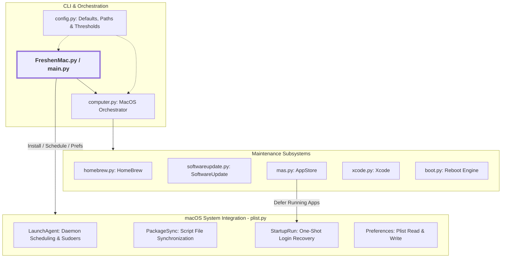

# FreshenMac

A friendly tool that automatically keeps macOS, Homebrew, and App Store apps updated.

[](https://apple.com/macos)
[](https://www.python.org/)
[](LICENSE)
[](#running-tests)

---

## Why I Built This

Every time my child came home from college, their laptop was in the same state: **zero updates installed**.

Even after I downloaded pending updates, they never restarted their computer to finish the install. Critical security
fixes and app updates sat there for months.

I built **FreshenMac** to keep their Mac updated and secure while they are away at school. It runs quietly in the
background on a schedule. It coordinates updates for Homebrew, the App Store, and macOS. It keeps your administrator
permissions active without nagging you for passwords. It waits to update open apps so it never interrupts your work.
When the Mac is truly idle, it politely restarts the computer.

---

## What It Does

- **Homebrew:** Updates tools and apps, and removes old files. Automatically detects and heals interrupted git rebases
  or dirty tap repositories. Some packages on Intel Macs need to build from source code using CMake. FreshenMac checks
  for Xcode build tools first. It then updates those packages one at a time so nothing gets blocked.
- **App Store:** Updates your Mac App Store apps using `mas`. If an app is open, FreshenMac waits to update it so you do
  not lose any work. It finishes updating that app the next time you log in. You can also ignore apps by name or ID
  number.
- **macOS Updates:** Stages and downloads system updates in the background. If an Apple Silicon Mac needs Volume Owner
  authentication, FreshenMac shows a friendly pop-up dialog and opens the right System Settings screen for you.
- **Xcode Tools:** Automatically accepts the Xcode license. It also sets up Xcode components quietly so you do not see
  pop-up boxes after a restart.
- **Polite Restarts:** Never surprises you with a restart. It gives you a pop-up dialog where you can restart now or
  snooze. If snoozed, it waits until nobody has used the Mac for at least 60 minutes. It also pauses Time Machine
  backups safely before rebooting.
- **FileVault Fast Restart:** Uses `fdesetup authrestart` to restart past FileVault encryption straight to your desktop.
  You do not get stuck waiting at the pre-boot password screen.
- **Scheduled Background Runs:** Sets up a standard macOS background task (`LaunchAgent`). By default, it runs every
  Sunday at 2:00 AM, or on any schedule you choose.

---

## Quick Start

### Prerequisites

- **macOS:** Version 12.0 (Monterey) or newer. Works on Apple Silicon and Intel Macs.
- **Python:** Version 3.9 or higher (works with macOS system Python 3.9.6+; tested through Python 3.14).
    - Download it from [python.org](https://www.python.org/downloads/) or install it with Homebrew.
    - macOS includes Python 3.9.6 when you install the Xcode Command Line Tools (`xcode-select --install`).
- **Xcode Command Line Tools:** (optional)
    - FreshenMac checks if you have these tools. If they are missing, it asks to install them or installs them for you.
- **Homebrew:** (optional) [`brew.sh`](https://brew.sh)
    - To install Homebrew, run this command in your Terminal:
      ```bash
      /bin/bash -c "$(curl -fsSL https://raw.githubusercontent.com/Homebrew/install/HEAD/install.sh)"
      ```
- **App Store CLI:** (optional) [`mas`](https://github.com/mas-cli/mas)
    - If Homebrew is on your Mac, FreshenMac installs `mas` for you automatically.

### Running Manually

Run the script directly in your Terminal:

```bash
# Run all updates (Homebrew, App Store, and macOS)
python3 FreshenMac.py

# Run updates without restarting your computer
python3 FreshenMac.py --no-reboot

# Show more details while running
python3 FreshenMac.py -v

# Show full details and command output
python3 FreshenMac.py -vv

# Trace mode (shows every detail with no character limit)
python3 FreshenMac.py --trace
```

*(Note: If you run from a cloned git folder, run `python3 src/FreshenMac.py` or switch to the `src` folder first).*

---

## Command Options

| Flag                    | Short    | Description                                                                                                               |
|:------------------------|:---------|:--------------------------------------------------------------------------------------------------------------------------|
| `--verbose`             | `-v`     | Show more detail (`-v`, `-vv`, etc.). Also limits output to 10,000 characters unless you set `--debug-limit`.             |
| `--debug-limit <N>`     | `-l <N>` | Set a custom character limit for logs (use a negative number for unlimited).                                              |
| `--trace`               |          | Maximum detail with no character limit. Same as `--debug-limit=-1 -vvvv`.                                                 |
| `--no-reboot`           | `-r`     | Run all updates, but skip reboot prompts and automatic restarts.                                                          |
| `--force-reboot`        | `-f`     | Force a restart when updates finish, skipping minimum uptime checks.                                                      |
| `--ignore-mas <APP...>` | `-i`     | Skip App Store apps by name or ID number (for example: `-i iPhoto 408981381`).  This is not persistent.  See `--schedule` |
| `--schedule "<CRON>"`   | `--cron` | Set a background schedule using standard 5-part cron syntax (for example: `--schedule "0 18 * * 1"`).                     |
| `--save-prefs [PREF]`   | `-s`     | Save a setting permanently to your preferences file. Run `-s` alone to view all settings.                                 |
| `--update`              | `-u`     | Update the installed background script if your current files have a newer build number.                                   |
| `--no-update`           |          | Do not update the background script even if newer files exist.                                                            |
| `--uninstall`           |          | Turn off and delete the scheduled background service.                                                                     |
| `--spinner`             |          | Test the terminal wave spinner animation.                                                                                 |

---

## Scheduling & Automation

FreshenMac can run quietly on its own using standard 5-field cron syntax:

```bash
# Run every Monday at 6:00 PM
python3 FreshenMac.py --schedule "0 18 * * 1"

# Run Monday through Friday at 2:30 AM
python3 FreshenMac.py --schedule "30 2 * * 1-5"

# Run on the 1st and 15th of every month at midnight
python3 FreshenMac.py --schedule "0 0 1,15 * *"
```

This creates a background service file here:
`~/Library/LaunchAgents/com.panther37.FreshenMac.plist`

To remove the scheduled service:

```bash
python3 FreshenMac.py --uninstall
```

### Saving Preferences

You can save your settings so FreshenMac remembers them every time it runs. Settings are stored in
`~/Library/Preferences/com.panther37.FreshenMac.plist`:

```bash
# View all settings and their current values
python3 FreshenMac.py --save-prefs

# Skip an App Store app by name (for example, old software like iPhoto)
python3 FreshenMac.py --save-prefs "no-mas=iPhoto"

# Skip an App Store app by its numeric ID number
python3 FreshenMac.py --save-prefs "no-mas=408981381"

# Skip multiple apps at once (separate names or IDs with a space)
python3 FreshenMac.py --save-prefs "no-mas=Aperture 408981381"
```

---

## How Rebooting Works

FreshenMac keeps your Mac secure without getting in your way:

1. **Checks Uptime and Requirements:** It only suggests a restart if your Mac has been turned on for more than 15 days,
   or if an installed macOS update requires a reboot.
2. **Asks Before Restarting:** If someone is using the Mac, a pop-up box asks you to **Restart Now** or **Snooze**.
3. **Waits for Idle Time:** If you click Snooze, FreshenMac waits until nobody is using the keyboard, mouse, or
   terminal. Once the computer has been quiet for 60 minutes, it safely restarts.
4. **Protects Backups:** If Time Machine is backing up files, FreshenMac asks it to pause safely before restarting.
5. **Fast FileVault Restart:** If FileVault disk encryption is turned on, FreshenMac uses `authrestart`. This boots
   straight back to the desktop without getting stuck at the login lock screen.
6. **Catches Up on Open Apps:** If an App Store app could not update because you were using it, FreshenMac schedules a
   quick update for your next login. Once that app is updated, the task removes itself.

---

## Architecture

FreshenMac is built with small, separate pieces where each tool has one job:



### Module Breakdown

- `FreshenMac.py`: Starts the program and returns the exit code.
- `freshenmac/main.py`: Reads command-line options, prompts for administrator passwords when needed, and starts tasks.
- `freshenmac/computer.py`: Coordinates the update run. Checks hardware details, uptime, and idle time. Prints the final
  summary report.
- `freshenmac/homebrew.py`: Updates Homebrew tools and apps. Handles source code builds on Intel Macs and cleans up old
  files.
- `freshenmac/mas.py`: Updates Mac App Store apps using `mas`. Checks for running apps so it does not interrupt your
  work.
- `freshenmac/softwareupdate.py`: Downloads and installs Apple macOS system updates. Opens System Settings if an owner
  password is required.
- `freshenmac/boot.py`: Handles computer restarts. Manages snooze dialogs, idle countdowns, Time Machine safety, and
  FileVault fast restarts.
- `freshenmac/xcode.py`: Checks for Xcode and Command Line Tools. Accepts the license agreement and finishes setup
  tasks.
- `freshenmac/plist.py`: Handles macOS system setup with four main parts:
    - `LaunchAgent`: Creates background schedule files and configures permissions so tasks run unattended.
    - `PackageSync`: Copies script files to the system script folder and updates them when newer builds are available.
    - `StartupRun`: Creates a one-time login task to finish updating apps that were open during the main run.
    - `SavePreferences` and `load_preferences`: Reads and saves user preferences.
- `freshenmac/config.py`: Stores default settings, timeouts, file paths, and rules.
- `freshenmac/util.py`: Helper tools: runs shell commands (`RunCMD`) and AppleScript (`RunAppleScript`), parses natural
  version numbers (`Version`), keeps administrator permissions active (`SudoKeepAlive`), and draws the progress
  spinner (`Wave`).

---

## Running Tests

FreshenMac has 289 automated tests. These tests verify that everything works correctly and that code follows strict
project rules (like keeping classes and methods in alphabetical order):

```bash
# Run all tests
PYTHONPATH=src python3 -m unittest discover -s test

# Run code style and structure checks
PYTHONPATH=src python3 -m unittest test/test_architecture.py
```

All tests are safe to run. They use mock data so they never restart your real computer or change your actual system
files.

---

## License & Contributing

- Distributed under the [BSD 3-Clause License](LICENSE).
- See [CONTRIBUTING.md](CONTRIBUTING.md) for contributor guidelines, testing instructions, and architectural invariants.

---

## Author

Created by **Matt Logan** (<matt@panther37.com>).
